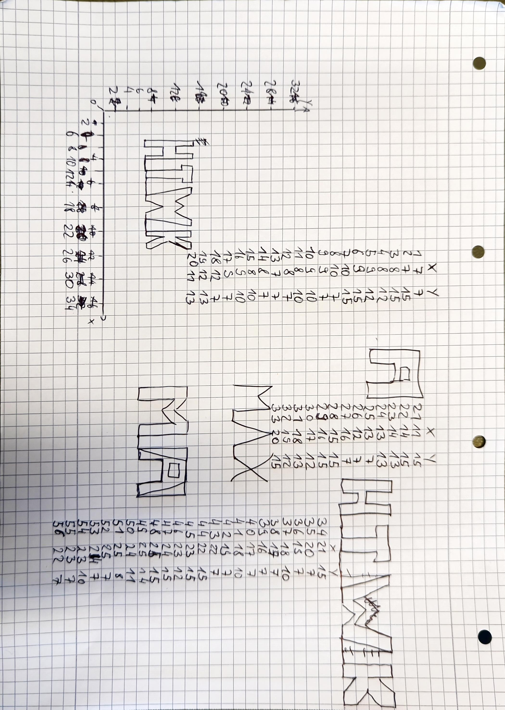

# oszitext

This is a little project that was created while wokring in the Labs of the HTWK. 

The main Idea was to print Text on an Oscilloscope. To archive that we wanted to use the B15 board first, but this is not possible duo Firmware/Driver restrictions.

So we came to the Idea of using a Adruino as an DAC.

To use a adruino as an DAC we needed an R-2R Ladder. This Idea came from this Project: [avr-binary-weighted-dac](https://github.com/trevor-makes/avr-binary-weighted-dac)

>"A binary-weighted DAC is a simple method for transforming multiple digital outputs into a single analog output using only resistors. The resistors are chosen from a >power-of-two sequence, with the largest resistor tied to the least-significant bit and the smallest resistor tied to the most-significant bit."
> -- trevor-makes

This is our schematic:

To create the text we used the Idea of this Project: https://electronoobs.com/eng_arduino_tut63.php

We adjusted the code so the HTWK Logo would show up on the Oszi.

